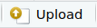

# Introducción

Hasta ahora hemos visto:

1.  Cómo trabajar con notebooks de R
2.  Cómo hacer operaciones aritméticas
3.  Cómo trabajar con strings o cadenas de texto
4.  Cómo crear y usar variables
5.  Cómo trabajar con vectores
6.  Cómo trabajar con funciones
7.  Cómo cargar y usar paquetes

¡Ya tenemos las herramientas necesarias para empezar a trabajar con datos reales!

En este notebook vemos cómo podemos cargar datos en R.

**Objetivos**

-   Cargar archivos de datos a RStudio
-   Leer datos en R con tidyverse
-   Ver tablas de datos

# Obtener datos

En este notebook vamos a explorar datos de pokemon.

**Instrucciones**

1.  Abre el siguiente enlace: [Datos pokemón](https://gist.githubusercontent.com/armgilles/194bcff35001e7eb53a2a8b441e8b2c6/raw/92200bc0a673d5ce2110aaad4544ed6c4010f687/pokemon.csv)
2.  Da click en *Archivo* \> *Guardar página como...* (da click en `CTRL + S`) y guarda los datos en tu computadora. Asegúrate de dejarle la extensión de archivo `.csv`

# Archivos .csv

El archivo que se te debió descargar es uno con extensión `.csv`. Estos son archivos muy comunes cuando trabajamos con datos. csv significa «Comma Separated Values», es decir, valores separados por comas. Este archivo lo puedes abrir con varios programas, por ejemplo, con un editor de texto cualquiera como *Block de notas* en Windows o *TextEdit* de Mac. Si lo abres verás algo así:


La primera fila nos da el nombre de las variables que tenemos separados por comas. Los nombres son bastante descriptivos y podemos facilmente deducir qué datos tenemos:

-   `#`: un identificador
-   `Name`: el nombre del pokemón
-   `Type 1`, `Type 2`: el tipo de pokemón
-   `HP`: el poder total del pokemón
-   `Attack`, `Defense`, `Sp. Atk`, `Sp. Def`, `Speed`: el puntaje de ataque, defensa, ataque y defensa especial y la velocidad
-   `Generation`: la generación a la que pertenece
-   `Legendary`: si es un pokemón legendario o no

Las siguientes filas nos dan los valores de las variables para distintos pokemón.

Por ejemplo, en la segunda fila tenemos los datos:

-   `Bulbasaur`
-   `Grass`
-   `Poison`
-   `318`

Esto nos dice que en *Bulbasaur es un pokemón de tipo pasto y veneno y que su HP es 318*.

Como podrás notar este archivo es similar a una tabla y si lo abres en una aplicación de hojas de cáclulo como Excel, Google Sheets o LibreOffice Calc, verás algo así:


Como podrás notar esto es como una tabla donde cada columna corresponde a una variable y cada fila a una observación:


Los archivos .csv son muy comunes para almacenar datos ya que son muy ligeros, se pueden abrir con cualquier programa y se pueden manipular fácilmente.

# Establecer el directorio de trabajo

Algo fundamental cuando trabajamos con R es establecer nuestro **Directorio de trabajo** o **Working directory**. Este es una cartpeta que RStudio utiliza para encontrar los archivos que uno quiera cargar.

Puedes ver cual es tu directorio de trabajo en la parte superior de tu consola:


También puedes preguntarle a R cuál es el directorio de trabajo con el siguiene comando:

```{r}
getwd()
```

Cuando trabajamos en RStudio usando Posit Cloud generalmente el directorio de trabajo ya está bien determinado y no hay que hacer nada. Sin embargo, cuando trabajamos en RStudio en nuestras computadoras personales debemos especificar nuestro directorio de trabajo. Para eso debemos dar click en **«Session \> Set Working Directory \> Choose Directory»** y elegir la carpeta donde queremos trabajar.


Otra forma de establecer el directorio de trabajo es usando la función `setwd()` a la cual le debemos dar la ruta completa a la carpeta donde queremos trabajar:

```{r}
# setwd("/cloud/project/")
```

# Subir los datos

Si trabajas en tu computadora personal solo debes colocar los datos el directorio de trabajo, pero al trabajar en Posit Cloud debemos subir los datos para poder usarlos.

Para subir los datos:

1.  En el panel inferior derecho de RStudio selecciona la pestaña **Files**

2.  Da click en **Upload**: 

3.  Da click en **Browse** en la sección de *File to upload*:

    

4.  Busca y selecciona tu archivo csv

5.  Listo. Tu archivo debe aparecer en la lista de archivos.

# Leer los datos

Para leer los datos vamos a usar un paquete que se llama **tidyverse**. Este generalmente hay que instalarlo primero, pero para este proyecto de Posit Cloud yo ya lo instalé previamente por lo que solo hay que pedirle a R que cargue el paquete con la función `library`:

```{r}
## Instalar tidyverse
# install.packages("tidyverse")

## Cargar tidyverse
library(tidyverse)

```

Para leer el archivo usamos una función que se llama `read_csv` a la cual como argumento debemos pasarle la el nombre del archivo que queremos leer (en forma de cadena):

```{r}

read_csv("./pokemon.csv")

```

Como podrás ver los datos R los reconoce como una tabla y el comando solo nos imprime una parte de los datos.

Nota como la consola se te da información sobre los datos que acabas de importar. En particular podemos ver que los datos tienen 800 filas y 13 columnas. Además abajo nos dice el tipo de dato con el que se importó cada columna. Podemos ver que las columnas `Name`, `Type 1` y `Type 2` las importó como cadenas de caracteres (`chr`). Las columnas `#`, `Total`, `HP`, `Attack`, `Defense`, `Sp. Atk`, `Sp. Def`, `Speed`, `Generation` las importó como números (`dbl`). Y la columna `Legendary` como un valor booleano (`lgl`) que solo puede tomar los valores `TRUE` o `FALSE`.

Para poder trabajar con los datos en R hay que guardarlos en una variable:

```{r}

pokemon <- read_csv("./pokemon.csv")

```

# Ver la tabla de datos

Para visualizar tus datos a manera de una hoja de calculo puedes usar el comando `View` el cual abre una nueva pestaña mostrando los datos:

```{r}

View(pokemon)

```

**Advertencia**: No es recomendable abrir de esta manera archivos muy grandes ya que puedes hacer que R se trabe.

Otra función útil para darnos una idea de cómo se ve un conjunto es la función `head` que nos muestra solo el inicio de nuestra tabla:

```{r}

head(pokemon)

```

Podemos controlar el número de filas que queremos ver con el argumento `n`:

```{r}

head(pokemon, n = 10)

```

Una función complementaria a `head` es la función `tail`, la cual nos muestra solo una parte del final de los datos:

```{r}

tail(pokemon, n = 3)

```

Otra función para echar un vistazo a los datos es la función `glimpse`, la cual nos muestra todas las columnas de manera horizontal:

```{r}

glimpse(pokemon)

```

Si solo queremos ver los nombres de las columnas de nuestros datos podemos usar la función `names`:

```{r}

names(pokemon)

```

# Ejercicio

En este ejercicio vas a descargar y cargar un conjunto de datos de películas de Pixar

1.  Descarga los datos del siguiente enlace: [películas pixa](https://gist.githubusercontent.com/b3m3bi/fca2b77734e5e3ca92cd4e4616737229/raw/ca1736594f47ae8c204c1eb51e2483d91caac26f/pixar-movies.csv)[r](https://gist.githubusercontent.com/b3m3bi/fca2b77734e5e3ca92cd4e4616737229/raw/ab39db8f7a7e99fd7267f8dc060343f75419d8de/pixar-movies.csv)
2.  Sube los datos a RStudio
3.  Lee los datos usando la función `read_csv` y guárdalos en una variable que se llame `pixar`
4.  Explora la tabla de datos con la función `View`.
5.  Responde a las siguientes preguntas:
    -   ¿Cuántas filas y cuantas columnas tienes?

    -   ¿Qué variables incluye tu conjunto de datos? ¿Qué crees que signifique cada variable?

```{r}
# Escribe aquí tu código


```
