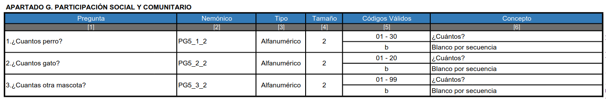
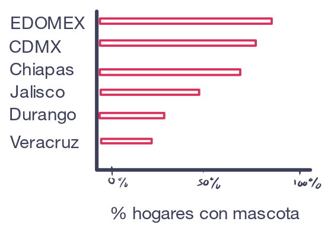
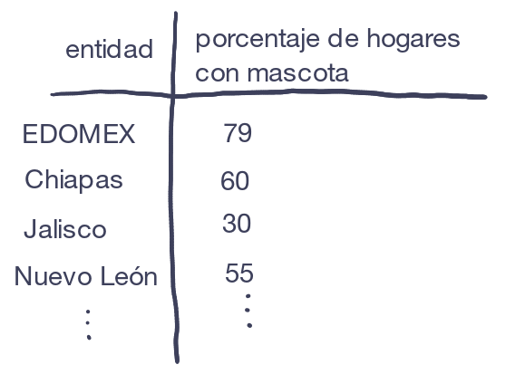
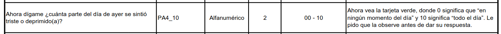
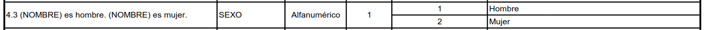
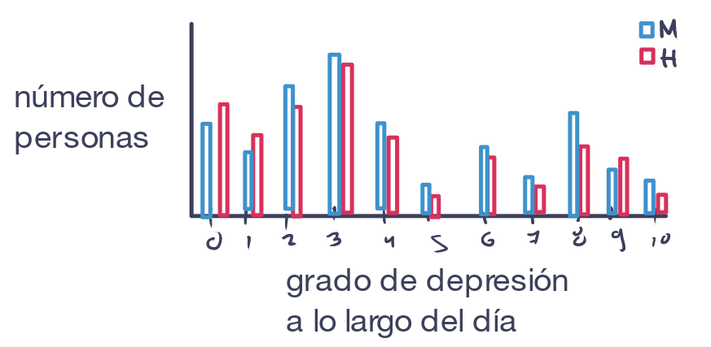
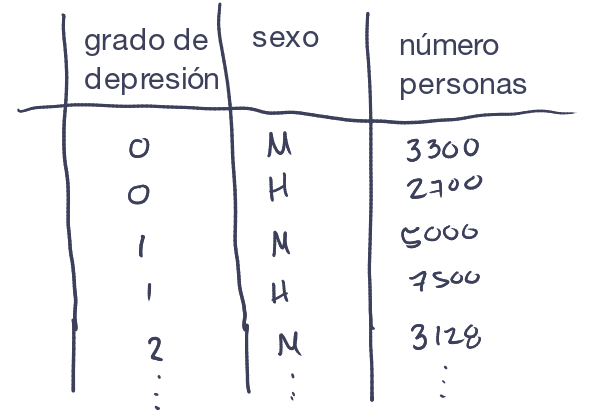

## Introducción

En esta Práctica vamos a visualizar datos de encuestas de INEGI. En particular vamos a utilizar la Encuestra de Bienestar Autoreportado (ENBIARE), la cual se realizó en 2021 y tiene como objetivo recopilar información sobre como las personas perciben su situación de bienestar.

**Objetivo**

-   Identificar como trabajar con microdatos de INEGI
-   Repasar el proceso de importación y manejo de datos en R
-   Crear visualizaciones de datos con R

## Descargar los datos

Primero descarguemos los datos.

1.  Accede a la siguiente liga: <https://www.inegi.org.mx/programas/enbiare/2021/>
2.  Entra en la pestaña de **Microdatos**
3.  Descarga el archivo **CSV** en la fila **Base de datos**.
4.  Se te descargará un archivo `.zip` el cual debes descomprimir.
5.  Sube los archivos que descargaste a RStudio de Posit Cloud (yo ya los subí previamente en la carpeta `data`)

En la carpeta que descargues encontrarás 4 archivos CSV. ¿Por qué tantos archivos? ¿Qué contiene cada uno? Para entender qué descargamos y cómo se organizan los datos debemos explorar archivos complementaria donde se describe toda la información necesaria para darle sentido a los datos.

## Explora los documentos complementarios

### Presentación de la encuesta

Una primera cosa que nos puede ser muy útil es leer la descripción general de la encuesta. Esta incluye información sobre los antecedentes y objetivos de la misma. Para acceder a ella:

1.  Accede a la siguiente liga: <https://www.inegi.org.mx/programas/enbiare/2021/>
2.  Da click en **Ver más presentación**
3.  Consulta las pestañas de información general de la encuesta.

### Presentación de resultados

Otra cosa que nos puede ayudar a entender qué contiene la encuesta es revisar la *Presentación de resultados*. Este es un documento con láminas con algunos de los principales resultados obtenidos de la encuesta que incluye varias visualizaciones. Para acceder a ella:

1.  Accede a la siguiente liga: <https://www.inegi.org.mx/programas/enbiare/2021/>
2.  Descarga el PDF de la **Presentacion de resultados**

### Cuestionario

También podemos consultar el Cuestionario que se usó para la encuesta. Este es la columna vertebral de la encuesta y organización de los datos. Revisarlo nos puede dar una idea de qué preguntas se hicieron, cómo se organizó en secciones y qué tipo de respuestas se podían registrar. Para acceder al cuestionario:

1.  Accede a la siguiente liga: <https://www.inegi.org.mx/programas/enbiare/2021/>
2.  Descarga el PDF del **Cuestionario**

### Descriptor de archivos

Finalmente, el archivo más importante par entender cómo se organizan los datos que descargamos es el **Descriptor de archivos**. Este es un documento que nos indica los códigos que se usaron para registrar en los CSV cada pregunta y cada valor. Para acceder al descriptor de archivos:

1.  Accede a la siguiente liga: <https://www.inegi.org.mx/programas/enbiare/2021/>
2.  Entra en la pestaña de **Microdatos**
3.  Descarga el archivo PDF en la fila **Descriptor de archivos**.

Nota como este archivo contiene la información de cada archivo que descargamos. Líneas grises separan el contenido de cada archivo y en la parte derecha por arriba de las líneas grises viene el nombre de los archivos que descargamos. Luego vienen un conjunto de tablas con las preguntas, el código o nemónico con el que se registró en los archivos o bases de datos e información de los valores que puede tomar cada variable/pregunta.

## Niveles de información de la encuesta

Después de explorar la encuesta podrás darte cuenta de que esta incluye información a varios niveles:

1.  Información de la vivienda (el espacio físico donde habita un hogar). Esta información viene en la tabla `TVIVIENDA`.
2.  Información sobre el hogar (conjunto de personas que viven juntas y comparten gastos). Esta información viene en la tabla `THOGAR`.
3.  Información sobre los miembros del hogar (cada individuo de un hogar). Esta información viene en la tabla `TSDEM`.
4.  Las respuestas de la encuesta de bienestar autoreportado de un miembro del hogar elegido al azar. Esta información viene en la tabla `TENBIARE`.

## Factor de expansión

Cuando se trabaja con encuestas algo muy importante es considerar el **factor de expansión**. Recordemos que en un **censo** se obtiene información de *toda* la población de interés. En contraste en una **encuesta** solo se obtiene de una *muestra* o *subconjunto* de la población. Sin embargo, a través de métodos estadísticos podemos hacer inferencias para hacer conclusiones sobre toda la población. Por ejemplo, para hacer nuestro muestreo se podría agrupar (estratificar) a la población de acuerdo a su sexo, nivel socioeconómico y edad. Dado que sabemos información demográfica del país, sabemos cuantas personas de la población total habría en cada grupo (estrato). Entonces en lugar de obtener información de toda la población se podrían elegir solo unos cuantos de cada grupo y a partir de sus respuestas estimar qué huberan contestado las otras personas de ese grupo (bajo el supuesto de que otras personas con características similares contestarían de manera similar). En particular el factor de expansión es un valor numérico que nos indica a cuantos otros individuos equivale la respuesta de un individuo muestreado. La definición precisa del factor de expansión tiene que ver con el inverso de la probabilidad de selección de un indiviuso y los detalles estadísticos se pueden consultar en el documento de **Diseño muestral** de la encuesta (ENBIARE \> Metodología \> Diseño Muestral)

## Cargar librerías y datos

Vamos a cargar tidyverse para tener acceso a las funciones que conocemos para manejar y visualizar datos:

```{r}
library(tidyverse)
```

Las tablas de datos son muy grandes y si las cargamos ocuparán mucha memoria en R y harán que este sea más lento. Además, cuando hagamos nuestras gráficas veremos que solo utilizaremos unas cuantas columnas por lo que nos va a convenir solo cargar las columnas que usemos para que estas usen menos memoria. Ahorita solo comprobemos que las tablas se pueden leer correctamente con `read_csv()` sin guardarlas en variables y veamos sus tamaños:

```{r}
read_csv("./data/TVIVIENDA.csv")
read_csv("./data/THOGAR.csv")
read_csv("./data/TSDEM.csv")
read_csv("./data/TENBIARE.csv")
```

**Pregunta**

-   ¿Cuántas observaciones y variables tiene cada tabla?
-   Si hay diferencias en el tamaño de las observaciones ¿a qué crees que se deba?

## Planear un gráfico

Antes ponernos a hacer una visualización debemos darnos una idea de a qué es a lo que queremos llegar. Para eso podemos pensar seguir los siguientes pasos:

1.  Identificar una pregunta que quiero explorar
2.  Hacer un boceto del gráfico que quiero hacer
3.  Hacer un boceto de cómo debe ser la tabla de datos para crear mi gráfico
4.  Identificar los pasos que debo de seguir para crear mi tabla
5.  Escribir el código necesario

Exploremos cómo hacer dos gráficas siguiendo este proceso para que luego ustedes lo apliquen a desarrollar su propia gráfica.

## Gráfica 1

### Planeación

Explorando el *Descriptor de archivos* de la encuesta podemos notar que hay un conjunto de preguntas sobre el número de mascotas en los hogares. Las preguntas son las siguientes que vienen en la tabla `THOGAR`:



Una pregunta que puede surgir de aquí es **¿en qué estados tienen más mascotas en los hogares?**

Luego podemos hacer un boceto de cómo nos imaginamos que se podría hacer una visualizaciones. En este caso podría ser un gráfico de barras que compare el porcentaje de hogares con mascotas para cada entidad:

 Luego podemos hacer un boceto de cómo debería ser una tabla que tuviera la información necesaria para crear este gráfico. En este caso requerimos una tabla con dos columnas: el estado y el porcentaje de hogares con mascota:

 ¿Qué información necesitamos para crear esa tabla?

-   Para calcular el porcentaje de hogares con mascota necesitamos saber dos cosas:
    1.  el número de hogares en cada entidad que tienen mascota, y
    2.  el número de hogares totales en cada entidad
-   Para crear estas tablas vamos a requerir agrupar los datos por entidad federativa
-   La información que requerimos corresponde a las preguntas `PG5_1_2`, `PG5_2_2`, `PG5_3_2`. Además requerimos la información de la entidad (`ENT`) y el factor de expansión (`FAC_HOG`). Todo esto lo podemos encontrar en la tabla `THOGAR`.

Además notemos los valores que tiene cada columna que usaremos:

-   `PG5_1_2`, `PG5_2_2`, `PG5_3_2`: son valores numéricos que representan el número de perros, gatos u otras mascotas en un hogar
-   `ENT` son la entidades representadas con un código. Estas están ordenadas alfabéticamente, es decir, el 01 es Aguascalientes, y el 32 es Zacatecas.
-   `FAC_HOG`: un valor numérico con el factor de expansión al que equivale cada hogar.

### Crear la gráfica

Primero carguemos los datos que necesitamos. Usaremos la función `read_csv()`, la cual tiene un argumento `col_sel` que nos permite pasarle como cadena el nombre de las columnas que necesitamos:

```{r}
datos_mascotas <- read_csv(
  "./data/THOGAR.csv", 
  col_select = c("ENT", "PG5_1_2", "PG5_2_2", "PG5_3_2", "FAC_HOG")
  )
```

Hagamos unas exploraciones previas para revisar y darle sentido a los datos. ¿Cuál es la población total que representa la encuesta? Recordemos que el factor de expansión es central ya que nos dice cuantos elementos de la población representa cada elemento muestreado. Entonces su suma nos debe dar el tamaño total de la población:

```{r}
datos_mascotas |> pull(FAC_HOG) |> sum()
```

**Pregunta**

-   ¿Por qué obtuvimos este valor? ¿Qué significa?

Ahora hagamos nuestra tabla con el total de hogares que hay en cada entidad:

```{r}
tabla_hogares_total <- datos_mascotas |> 
  group_by(ENT) |>
  summarise(
    hogares_total = sum(FAC_HOG)
  )
```

Ahora hagamos nuestra tabla con el total de hogares con mascota en cada entidad. Para eso podemos filtrar los datos y quedarnos solo con los datos donde se registro al menos alguna mascota:

```{r}
tabla_hogares_mascota <- datos_mascotas |>
  filter( !is.na(PG5_1_2) | !is.na(PG5_2_2) | !is.na(PG5_3_2)) |>
  group_by(ENT) |>
  summarise(
    hogares_con_mascota = sum(FAC_HOG)
  )
```

Ahora juntemos nuestras tablas. Para eso usemos la función `left_join()`, la cual nos junta dos tablas de acuerdo a los valores de columnas que comparten quedándose con la tabla de la izquierda (el primer argumento que le pasemos):

```{r}
tabla_mascotas <- left_join(tabla_hogares_mascota, tabla_hogares_total)
```

Ahora hagamos el cálculo del porcentaje de hogares con mascota:

```{r}
tabla_mascotas <- tabla_mascotas |>
  mutate(
    porcentaje_hogares_con_mascota = hogares_con_mascota / hogares_total * 100
  )
```

Un problema que tenemos es que las entidades están escritas con una clave, pero para nuestro gráfico queremos los nombres de la entidad. Para eso debemos:

1.  Entrar al [Catálogo Unico de Claves de Áreas Geoestadísticas](https://www.inegi.org.mx/app/ageeml/).
2.  Para solo obtener las claves estatales en *Nivel de desagregación* seleccionamos *Área Geoestadística Estatal (AEGG)* y dar click en *Consultar*
3.  En el ícono de descargar seleccionamos en la sección CSV el archivo con codificación UTF-8.
4.  Subir este archivo a Posit Cloud (yo ya lo subí previamente a la carpeta `data` con el nombre `claves_entidades.csv`)

Ahora cargamos el archivo con las claves. Solo nos quedamos con la información de las claves y nombres:

```{r}
claves_entidades <- read_csv("./data/claves_entidades.csv") |>
  select(CVE_ENT, NOM_ENT, NOM_ABR)
```

Ahora podemos juntar esa información a nuestra tabla usando de nuevo `left_join()`. Solamente que en este caso como la columna con la clave no tiene el mismo nombre en ambas columnas debemos pasarle el argumento `by = c("ENT" = "CVE_ENT")` para decirle que los valores de la columna `ENT` de `tabla_mascotas` lo junte con base en los valores de `CVE_ENT` de la tabla `claves_entidades`:

```{r}
tabla_mascotas <- left_join(tabla_mascotas, claves_entidades, by = c("ENT" = "CVE_ENT"))

tabla_mascotas
```

Y listo, ya tenemos una tabla con la información que nos interesa: el porcentaje de hogares con mascota y las entidades. Ahora hagamos la gráfica:

```{r}
ggplot(
  tabla_mascotas,
  aes(x = porcentaje_hogares_con_mascota, y = fct_reorder(NOM_ENT, porcentaje_hogares_con_mascota))
) + 
  geom_col() +
  labs(
    x = "Porcentaje de hogares con mascota",
    y = "Entidad"
  )
```

Para destacar más las diferencias podemos cambiar el gráfico a un gráfico de punto, agregarle una capta con el valor de los porcentajes, y agregarle título, subtitulo y caption:

```{r}
ggplot(
  tabla_mascotas,
  aes(x = porcentaje_hogares_con_mascota, y = fct_reorder(NOM_ENT, porcentaje_hogares_con_mascota))
) + 
  geom_point(color = "tomato") +
  geom_text(aes(label = paste0(round(porcentaje_hogares_con_mascota, 1), "%")),size = 3, nudge_x = 0.75, color = "gray50") +
  labs(
    x = "Porcentaje de hogares con mascota",
    y = "Entidad",
    title = "Hogares con mascota en México",
    caption = "Datos: INEGI. ENBIARE (2021)",
    subtitle = "Campeche es el estado con mayor porcentaje de hogares con mascota.\nMientras que la CDMX es el estado con menor porcentaje de hogares\ncon mascota."
  ) +
  theme_minimal()
```

## Gráfica 2

### Planeación

Explorando el *Descriptor de archivos* de la encuesta podemos notar que hay una pregunta sobre el grado de depresión que se sintió a lo largo del día:



Y también sabemos que tenemos la información sobre el sexo de las personas entrevisadas:



Una pregunta que podríamos explorar es **¿el grado de depresesión a lo largo del día difieren entre sexos?**

Para ello podríamos hacer un gráfico de barras agrupado por sexo como el siguinete:



Y para construir este gráfico necesitaríamos una tabla que se viera así:



Para crear esta tabla necesitamos:

1.  La pregunta `PA4_10` de la tabla `TENBIARE` con la información del grado de depresión en un día. Este tiene valores del 0 al 10 con el grado de depresión que reportaron a lo largo del día.
2.  `FAC_ELE` con el factor de expansión de la tabla `TENBIARE`, con el factor de expansión de esa respuesta.
3.  La información de `SEXO` de la tabla `TSDEM` con la información del sexo de la persona encuestada. Este valor puede ser `1` que significa `Hombre` o `2` que es `Mujer`.
4.  Como tenemos que juntar la información de dos tablas distintas necesitamos las variables que nos permiten identificar a los elementos de una tabla en otra, en este caso son las columnas `FOLIO` (número de encuesta), `VIV_SEL` (número de vivienda seleccionada), `HOGAR` (número de hogar seleccionado) y `N_REN` (número de miembro del hogar)

### Crear la gráfica

Primero cargamos los datos que necesitamos de depresión:

```{r}
datos_depresion <- read_csv(
  "./data/TENBIARE.csv", 
  col_select = c("FOLIO", "VIV_SEL", "HOGAR", "N_REN", "PA4_10", "FAC_ELE")
  )
```

Veamos rápidamente cual es la población total que representan estos datos:

```{r}
datos_depresion |> pull(FAC_ELE) |> sum()
```

**Pregunta**

-   ¿Qué significa este valor? ¿Por qué no es igual a la población total de México?
-   Si sabemos que la entrvisa solo se aplica a mayores de 18 años que hablan español, ¿tiene más sentido este valor?

Ahora cargamos los datos que necesitamos del sexo:

```{r}
datos_sexo <- read_csv(
  "./data/TSDEM.csv",
  col_select = c("FOLIO", "VIV_SEL", "HOGAR", "N_REN", "SEXO", "FAC_HOG")
)
```

Veamos rápidamente cual es la población total que representan estos datos:

```{r}
datos_sexo |> pull(FAC_HOG) |> sum()
```

**Pregunta**

-   ¿Qué significa este valor?

Ahora juntemos los datos de sexo con las personas entrevistadas. Como tenemos que las tablas que permiten mapear los valores de una tabla a otra comparten el mismo nombre no necesitamos especificar los nombres de las columnas que usamos para hacer la unión:

```{r}
datos_depresion <- left_join(datos_depresion, datos_sexo)
```

Ahora hagamos nuestra tabla de resumen. Neceistamos agrupar por nivel de depresión (`PA4_10`) y por sexo (`SEXO`) y sumar los factores expansión de los encuestados (`FAC_ELE`):

```{r}
tabla_depresion <- datos_depresion |>
  group_by(PA4_10, SEXO) |>
  summarise(
    num_personas = sum(FAC_HOG)
  )
```

Ahora podemos cambiar los números `1` y `2` del la columna `SEXO` por etiquetas que digan `Hombre` y `Mujer`. Para eso podemos usar `mutate` con la función `if_else()` que recibe como primer argumento una condición a probar, como segundo el valor que se asigna si la condición es verdadea y como tercer argumento el valor que se asigna si es falsa:

```{r}
tabla_depresion <- tabla_depresion |>
  mutate(
    SEXO = if_else( SEXO == 1, "Hombre", "Mujer" )
  )
```

Finalmente hacemos la gráfica:

```{r}
ggplot(
  tabla_depresion,
  aes(x = PA4_10, y = num_personas, fill = SEXO)
) +
  geom_col(position = "dodge") +
  labs(
    x = "Nivel de depresión a lo largo del día",
    y = "Número de personas",
    fill = "Sexo",
    title = "Depresión a lo largo del día en México",
    caption = "Datos: INEGI. EMBIARE (2021)",
    subtitle = "En la encuesta se les preguntó ¿cuánta parte del día anterior se sintieron deprimidos?\n0=Nada y 10=Todo el día"
  ) +
  theme_minimal()

```

**Interpeta**

-   ¿Qué patrones ves en la gráfica?
-   ¿Cómo explicarías lo que ocurre en la gráfica?

## Gráfica 3

### Planeación

Ahora ustedes deben desarrollar su propia gráfica. Primero Planea:

1.  Elige una **Pregunta a explorar**
2.  Haz un **Boceto de la visualización** a la que quieres llegar
3.  Haz un **Boceto de la tabla** que necesitas para contruir tu visualización
4.  Enlista los **Pasos que debes seguir**

### Crear la gráfica

En las siguientes celdas puedes crear tu gráfica. Para agregar más celdas puedes dar usar el atajo `CTL + ALT + I` o dar click en el Icono para agregar más celdas (un signo de + y una C) en RStudio que está en la parte superior derecha de la pestaña.

```{r}


```

```{r}


```

```{r}


```

```{r}


```

```{r}


```
