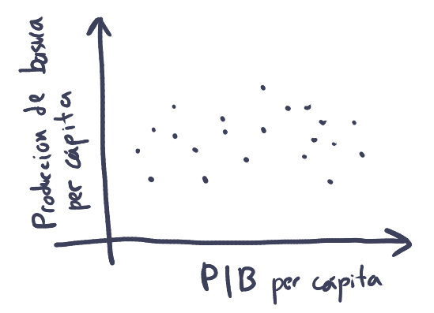

## Introducción

En este notebook vamos a empezar a explorar el mundo de la visualización de datos con R. En particular vamos a usar el paquete más famosos para crear visualizaciones el cual se llama `ggplot2`.

**Objetivos**

-   Conocer el uso y síntaxis básica de `ggplot` para crear gráficos en R.

## Cargar los paquetes

`ggplot2` es parte de `tidyverse` por lo que al cargar `tidyverse` también estamos cargando `ggplot2`.

```{r}
## Si no están instalados los paquetes los instalamos
# install.packages(c('tidyverse', 'janitor'))

# Cargamos tidyverse
library(tidyverse)

```

Puedes ver como en la consola al cargar `tidyverse` nos indica que también se cargó `ggplot2`:

## Leer los datos

En este notebook vamos a utilizar un conjunto de datos que incluye diversa información ambiental, económica y de salud de los países para el año 2020. Los datos fueron obtenidos principalmente de [Our World in Data](https://ourworldindata.org/) y del [World Bank Open Data](https://data.worldbank.org/). Para ver cómo se descargó y creo el conjunto de datos puedes consultar el script que se llama `preparacion_datos.R`. El archivo con los datos se llama `misc_world_data_2020.csv`.

En la siguiente celda cargamos los datos, y los abrimos con `View` para ver qué tienen:

```{r}
datos <- read_csv("misc_world_data_2020.csv")

View(datos)
```

**Preguntas:**

-   ¿Cuántas variables y cuantas observaciones incluye nuestra tabla de datos?
-   ¿Qué tipo de variable es cada una? (cualitativa, cuantitativa, ordinal, no ordinal, discreta, continua)
-   ¿Qué tipo de preguntas podrías explorar con las variables que incluye el conjunto de datos?
-   Esboza 3 gráficas que te imaginas que puedes crear con este conjunto de datos. Indica claramente a qué atributo mapearías cada variable de tu gráfico.

## El primer gráfico

¿Cuáles son los países que generan más basura? ¿Existe alguna relación entre la riqueza de un pais y su producción de basura? Hagamos un primer gráfico que nos ayude a viualizar si existe una relación entre el producto interno burto per cáptia y la producción de basura per cápita.

Este primer gráfico podría ser un gráfico de dispersión que se vea de la siguiente manera:



Donde en el eje de las x mapeamos el producto interno burto per cápita y en el eje de las y ponemos la producción de basura per cápita.

## Crear un lienzo en blanco

Para crear gráficas con ggplot usamos la función `ggplot()`, la cual recibe como primer argumento la tabla que contiene los datos que queremos graficar. Esto nos crea una gráfica vacía ya que aún no le hemos dicho como queremos visualizar la información.

```{r}

ggplot(data = datos)

```

En el panel de inferior derecho de RStudio, en la pestaña Plots se mostrarán las gráficas que vayamos creando. En este caso verás una gráfica en blanco.

## Mapear las variables a atributos

Lo siguiente que debemos hacer es decirle a `ggplot()` cuál es la información que queremos representar visualmente, es decir, cómo mapear las variables a atributos visuales o **aesthetics**. Para definir los atributos visuales usamos el argumento `mapping` de `ggplot()`, el cual **siempre se define** con la función `aes()`.

La función `aes()` tiene diversos argumentos que representan los atributos posibles de un gráfico:

-   `x`: posición en x
-   `y`: posición en y
-   `size`: tamaño
-   `color`: color de línea o contorno
-   `fill`: color de relleno
-   `linestyle`: patrón de línea
-   `shape`: forma de marcador
-   etc...

A estos argumentos, le pasamos el nombre de la variable (columna) la cual queremos que represente (en este caso `gdp_per_capita` y `waste_per_capita_tons_year`):

```{r}

ggplot(
  data = datos,
  mapping = aes(x = gdp_per_capita, y = waste_per_capita_tons_year)
)

```

Nuestro lienzo sigue sin mostrar los datos, pero ahora tiene más estructura ya que nos muestra la información de los ejes.

## Agregar objetos geométricos

Para podes visualizar la información debemos de agregar *objetos de geometría* o **geoms**. Existen diversas geometrías en `ggplot` las cuales son fáciles de reconocer ya que son funciones que inician todas con `geom_`. Por ejemplo, para crear una capa con puntos usamos `geom_point()`.

```{r}
ggplot(
  data = datos,
  mapping = aes(x = gdp_per_capita, y = waste_per_capita_tons_year)
) +
  geom_point()
```

¡Y listo ya creamos nuestro primer gráfico de dispersión en R!

Nota como para agregar "capas" a nuestro gráfico utilizamos el signo de suma `+`. Generalmente ponemos cada "capa" nueva en un renglón aparte para que sea más fácil de leer nuestro código. **Es muy importante que pongas el signo de más hasta el final de la línea anterior**, si no haces esto `ggplot` se confunde y te arrojará errores.

Otra cosa adicional a notar es que en la consola R nos pone una advertencia que dice:

```         
Warning: Removed 23 rows containing missing values or values outside the scale range (`geom_point()`).
```

Aquí lo que nos está advirtiendo ggplot es que quitó 23 filas de datos para las que faltaban los datos ya sean de PBI per cápita o de producción de basura per cápita. Este tipo de advertencias te las econtrarás de muy seguido y son muy útiles ya que R siempre decide avisarte que hay valores que faltan. Muchas veces podemos seguir adelante ignorando esas advertencias, pero en otros casos, es muy importante conocer nuestros datos faltantes para interpretar correctamente nuestros datos.

**Interpeta**

-   ¿Qué nos dice nuestro gráfico?
-   ¿Cómo sugiere el gráfico que es la relación entre el PBI y la producción de basura per cápitas?

## Agregar atributos

Los gráficos de dispersión son muy útiles para mostrarnos información sobre la relación entre dos variables numéricas (cualtitativas). Pero también podríamos agregar más información, por ejemplo, podríamos agregar la información del continente de los países al color de los marcadores. Para eso necesitamos agregar este mapeo en la función `aes()`:

```{r}
ggplot(
  data = datos,
  mapping = aes(x = gdp_per_capita, y = waste_per_capita_tons_year, color = continent)
) +
  geom_point()
```

Cuando mapeamos una variable categórica (cualitativa) a un atributo `ggplot` automaticamente le asigna un valor único a cada posible valor (aquí cada uno de los 6 continentes)

**Interpreta**

-   ¿Qué observas en la gráfica?
-   ¿Notas algún patrón en donde se ubican los países en el gráfico?
-   ¿Cómo se relaciona esto con lo que sabes?

## Agregar capas

Podemos notar que parece haber una relación positiva entre PBI y producción de basura per cápita. Para resaltar más claramente esta tendencia podemos agregar otra capa con una línea suave que muestre esta relación. Para eso podemos usar `geom_smooth()`.

```{r}
ggplot(
  data = datos,
  mapping = aes(x = gdp_per_capita, y = waste_per_capita_tons_year, color = continent)
) +
  geom_point() +
  geom_smooth()
```

Por defecto `geom_smoot()` nos agrega lineas curvas. Estas son algo confusas y difíciles de interpretar. Si queremos que nos agregue líneas rectas podemos decirle que queremos un modelo lineal (`lm`) en su argumento `method`:

```{r}
ggplot(
  data = datos,
  mapping = aes(x = gdp_per_capita, y = waste_per_capita_tons_year, color = continent)
) +
  geom_point() +
  geom_smooth(method = "lm")
```

Listo. Con lineas rectas podemos resaltar mejor la tendencia que nos interesa. Sin embargo, podemos ver que nos creo una línea por cada continente, algo que sería mejor es tener una sola línea de todo el mundo. Para ello debemos evitar que el color sea un *mapeo global*.

Nota como el mapeo de las variables a los atributos lo hicimos en la función `aes` dentro de la función `ggplot`. En este sitio hacemos **mapeos globales** que van a usar todas las capas que agreguemos. Sin embargo, cada función `geom_` tiene su propio argumento `mapping` con el cual podemos hacer **mapeos locales**. En este caso queremos que sólo los puntos tengan color, por lo tanto, definimos el mapeo al color solo dentro de `geom_point` en lugar de definirlo dentro de `ggplot`:

```{r}
ggplot(
  data = datos,
  mapping = aes(x = gdp_per_capita, y = waste_per_capita_tons_year,)
) +
  geom_point(mapping = aes(color = continent)) +
  geom_smooth(method = "lm")
```

## Enchular la gráfica

### Forma del marcador

Podemos mejorar más nuestra gráfica. Una primera cosa que podemos hacer es hacer que la forma de los marcadores también cambie de acuerdo al continente. Esto hace que la gráfica sea amigable y accesible. Para eso agregamos a `goem_point` un mapeo a la forma `shape`:

```{r}
ggplot(
  data = datos,
  mapping = aes(x = gdp_per_capita, y = waste_per_capita_tons_year,)
) +
  geom_point(mapping = aes(color = continent, shape = continent)) +
  geom_smooth(method = "lm")
```

### Cambiar color de línea

Podemos cambiar el color de línea por ejemplo a negro y agregarle opacidad. Para ello dentro de `geom_smooth` podemos cambiar el argumento `color` y el argumento `alpha`:

```{r}
ggplot(
  data = datos,
  mapping = aes(x = gdp_per_capita, y = waste_per_capita_tons_year,)
) +
  geom_point(mapping = aes(color = continent, shape = continent)) +
  geom_smooth(method = "lm", color = "black")
```

### Agregar titulos de gráfico y eje

Otra cosa que podemos mejorar es agregarle mejores etiquetas a los ejes. Para eso podemos usar la función `labs()` la cual podemos agregar en una nueva capa. En la función `labs()` tenemos diversos argumentos donde podemos poner como cadenas el texto que queremos:

-   `x`: nombre del eje x
-   `y`: nombre del eje y
-   `title`: título del gráfico
-   `subtítulo`: subtítulo del gráfico
-   `caption`: texto en chiquito debajo del gráfico (generalmente para incluir el origen de los datos)
-   además podemos agregar cualquier otro atributo de mapeo para cambiarle el nombre que muestra (e.g., color, shape)

```{r}
ggplot(
  data = datos,
  mapping = aes(x = gdp_per_capita, y = waste_per_capita_tons_year,)
) +
  geom_point(mapping = aes(color = continent, shape = continent)) +
  geom_smooth(method = "lm", color = "black") +
  labs(
    x = "PIB per cápita",
    y = "Producción de basura per cápita",
    title = "PIB y producción de basura",
    subtitle = "Conforme incrementa el PIB la producción de basua aumenta",
    caption = "Datos: Our World in Data, 2020",
    color = "Continente",
    shape = "Continente"
  )
```

### Guardar nuestros gráficos en variables

Nuestros gráficos los podemos guardar en vairables para seguirlos modificando a nuestro gusto poderiormente. Por ejemplo:

```{r}
mi_grafica <- ggplot(
  data = datos,
  mapping = aes(x = gdp_per_capita, y = waste_per_capita_tons_year,)
) +
  geom_point(mapping = aes(color = continent, shape = continent)) +
  geom_smooth(method = "lm", color = "black") +
  labs(
    x = "PIB per cápita",
    y = "Producción de basura per cápita",
    title = "PIB y producción de basura",
    subtitle = "Conforme incrementa el PIB la producción de basua aumenta",
    caption = "Datos: Our World in Data, 2020",
    color = "Continente",
    shape = "Continente"
  )
```

Si yo llamo a mi gráfico lo puedo ver y seguir usando:

```{r}
mi_grafica
```

### Cambiar escala de colores

Podemos seguir modificando nuestra gráfica, por ejemplo, agregarle cambiarle la escala de color que usa. Por ejemplo, podemos usar la función `scale_color_brewer()` y pasarle en su argumento `palette` algunoa de las siguientes escalas de color:


```{r}
mi_grafica +
  scale_color_brewer(palette = "Set1")
```

### Cambiar el tema

Finalmente también podemos cambiar el tema general de nuestra gráfica. Existen por defecto varios temas que puedes consultar [aquí](https://ggplot2.tidyverse.org/reference/ggtheme.html). Los temas son funciones que inician con `theme` y que se agregan como capas:

```{r}
mi_grafica +
  scale_color_brewer(palette = "Set1") +
  theme_minimal()
  
```

## Se pueden hacer cosas muy bonitas

Con ggplot se pueden hacer gráficos tan bonitos como uno quiera. Se requiere mucha práctica y conocimiento pero aquí puedes ver una [galería de algunas figuras creadas con ggplot](https://nrennie.rbind.io/art-of-viz/appendix.html#images)

## Ejercicios

1. ¿Cómo es la relación entre emisiones de CO2 y producto interno bruto? Crea una gráfica que muestre esta relación

```{r}


```

2. ¿Cómo se relaciona el gasto en salud a la mortalidad infantil? Crea una gráfica que muestre esta relación

```{r}


```

3. Modifica tu gráfico del punto 1 para que el tamaño de los marcadores muestre el tamaño de la población.

```{r}


```

